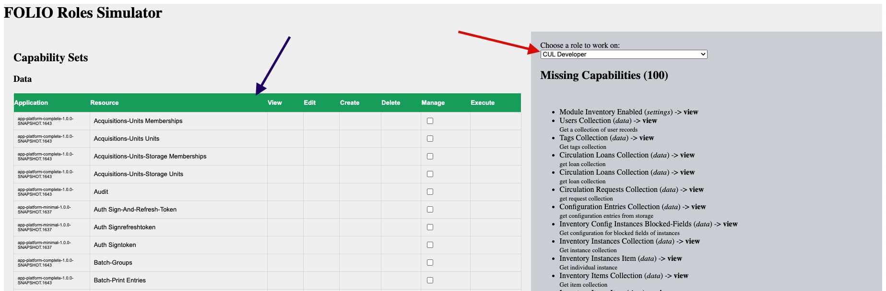
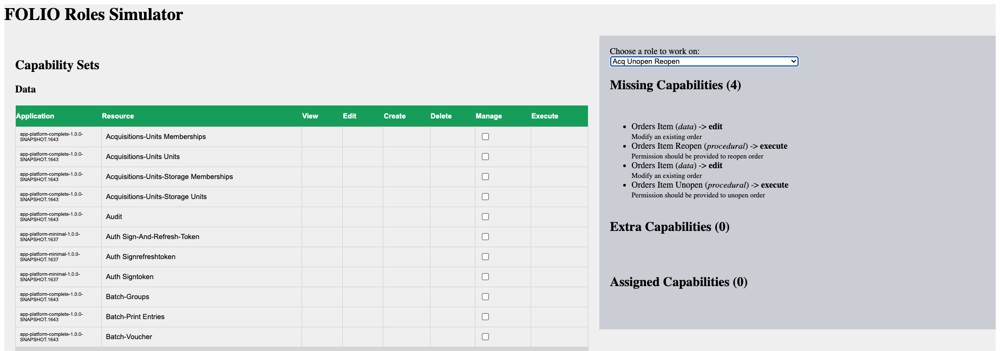
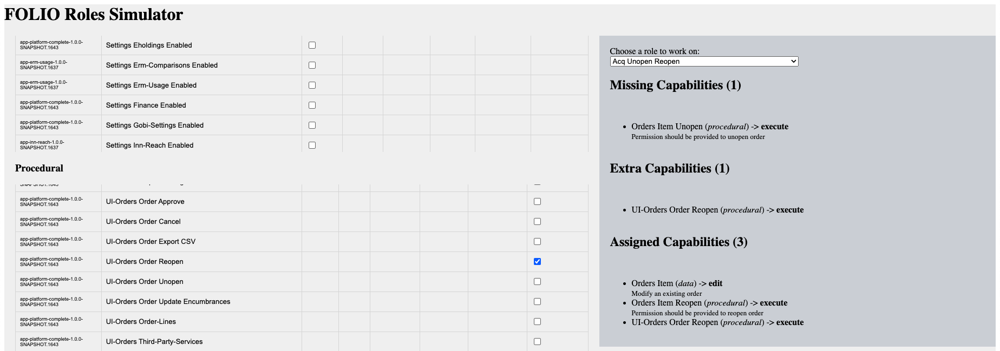

# Overview

This is a set of Python tools for helping with the migration from FOLIO OKAPI platform to FOLIO Eureka platform. A lot of the scripts need to be ran in the order presented below as they build upon each other. I purposely did not combine them into a single function as to allow for the review of data at each step.

# Installation

Copy .env.example over to .env and populate with your local settings.

```bash
source .venv/bin/activate
pip install -r requirements.txt
```

# Running

There is an interactive menu that has been added to make it easier to run the included scripts. This menu can be accessed by running:


```bash
python ./main.py
```

## Menu options

### 1. Pull Reference Data:

This menu option runs four scripts:
- Script one pulls all OKAPI permissions.
- Script two pulls all EUREKA Capabilities .
- Script three pulls all EUREKA Capability Sets.
- Script four pulls all OKAPI User Permissions from your reference environment.

### 2. Build Comparisons:

This menu option runs three comparison scripts against the data pulled in the first menu option.
- Script one add all the sub capability data to the capability sets; this option also generates a web page displaying tthe data in an easy to read format.
- Script two compares permissions to capabilities.
- Script three builds a comparison of current user permission sets to capabilities.

### 3. Build Working CSV and HTML File: 

This menu option runs two scripts that builds upon the data generated in the second menu option.
- Script one looks at the data generated from comaring the current user permissions to capabilities and looks to see what capability sets could be used to fullfill the orginal permission sets. This file can be edited and resubmitted.
- Script two creates the "FOLIO Roles Simulator" web interface. This uses the data collected in the previous steps to create a dynamic web interface to test creating roles. 


### 4. Reprocess the Capability Set Selection File (csv):

This menu option takes the CSV file generated in menu option 3 and re-precesses it.

### 5. Run a Specific Script: 

Each of theses menu options are outlined below.

- **Pull Reference Data - OKAPI Permissions**: 
- **Pull Reference Data - Capability Sets**: 
- **Pull Reference Data - Capabilities**: 
- **Pull Reference Data - OKAPI Permission Sets**: 
- **Expand Capability Sets**: 
- **Compare OKAPI Permissions to Eureka Capabilities**: 
- **Compare Current User Permission Sets to Eureka Capabilities**: 
- **Find Possible Capability Matches to OKAPI Permissions**: 
- **Build Web Interface - FOLIO Roles Simulator**: 
- **Reprocess the Capability Set Selection File (csv)**: 
- **Main Menu**: 

### 6. Quit: 


# Individual Scripts

## Data Retrieval Functions

## Pull Reference Data - OKAPI Permissions

 !!! Run First !!!
 This script needs to be ran first to pull all the permission sets from an OKAPI instance of FOLIO. By Default Ramsons BugFest has been added to the .env file.

## Pull Reference Data - Capability Sets

 !!! Run First !!!

This script pulls the Capability Sets from the Eureka platform and saves them in JSON format to be used later.

- _At this time i can not log in via the API, so the JSON was pulled via the web interface and saved into a JSON file._

## Pull Reference Data - Capabilities

 !!! Run First !!!

This script pulls the Capabilities from the Eureka platform and saves them in JSON format to be used later.

## Pull Reference Data - OKAPI Permission Sets

This script pulls the current permission sets form your reference system and saves them in JSON format. The reference system should be a production or test system with a current set of user permission sets.

---
## Data Formatting Functions

## Expanded Capability Sets

This scripts takes the Capability set data and expands out the linked capabilities. 

### Files generated:

- `FILE_EUREKA_CAPABILITY_SETS_EXPANDED`: JSON file listing all the capability sets and the capabilities assigned to that set
- `FILE_EUREKA_CAPABILITY_SETS_EXPANDED_CSV`: CSV file of the same data set.
- `FILE_EUREKA_CAPABILITY_SETS_EXPANDED_HTML`: HTML Table view that can be opened directly in the browser or saved to Confluence.

## Compare OKAPI Permissions to Eureka Capabilities

This script pulls the Capability Sets and uses the published names to match them to a OKAPI permission set. It expands on the included capabilities and permissions to show the names and UUIDS.  Two files are generated:
`FILE_COMPARED_SETS_TO_PERMISSIONS`: JSON file with all the collected data
`FILE_COMPARED_SETS_TO_PERMISSIONS_CSV`: CV file that can be opened in Excel for easier viewing. the first row is are the headers. The data is formatted as:

**Eureka capability set**: _id	name	type	resource	description	action_

**Found OKAPI Permission Set**: _okapiDisplayName_

**Eureka linked Capabilities**: _subCapabilities.name	subCapabilities.type	subCapabilities.resource	subCapabilities.description	subCapabilities.action_

**OKAPI sub permissions (if a Matching permission set is found)**: _okapiSubPermissions.name	okapiSubPermissions.description	okapiSubPermissions.permissionName_


## Compare Current User Permission Sets to Eureka Capabilities

This script takes current permission sets in the reference environment (visible, and mutable) expands the sub permissions. During this process it adds the supervision name, and description if they are included. it also looks to see if there is a matching capability, and lists that data. 
This should allow a user to re-create a permission set using just capabilities. 

### Files generated:

- `FILE_COMPARED_CURRENT_TO_CAPABILITIES`: JSON version of the expanded data
- `FILE_COMPARED_CURRENT_TO_CAPABILITIES_CSV`: CSV version of the same data set

---
## Create Working Documents

## Find Possible Capability Matches to OKAPI Permissions

This script will look that the JSON generated from `compareCurrentToCapabilities.py` and compare the assigned Compatibility sets and rank what set may bes fit in a new role that will match the Permission Set. It does this by looking at the capability Sets individual capabilitys and then matches thos to the ones in the permission set. The fallowing data will be added:

**Total** - Total number of capabilities in the set

**Matching** - Number of matching Capabilities to the permission set

**Ranking** - based on the percentage of total number of capabilities that match

Items with a rank of 0 or lower then X will be ignored.

### Files generated:

- `FILE_COMPARED_CURRENT_TO_CAPABILITIES`: JSON version of the expanded data
- `FILE_COMPARED_CURRENT_TO_CAPABILITIES_CSV`: CSV version of the same data set

## Build Web Interface - FOLIO Roles Simulator

This script will take the data produced in the previous scripts and generate a web interface that allows a user to pull up a current Permission Set and rebuild it using Capability Sets and Capabilities. No server is required to run this page it runs entirely in the users browser.

### How to use 

 - Open the generated HTML in the browser of you choice (tested with Chrome)
 - Select a Permission Set from the drop down in the left hand side of the screen. (red arrow)
 - Using the interface on the right side of the screen first start to select Capability sets to fill in the majority of your missing capabilities, for your permission set. (blue arrow)
 - Use the Capabilities section to fill any smaller gaps. (blue arrow)

 

In this image you can see that the Permission Set "Acq Unopen Reopen" has been selected. The three sections under the selection box are:
- Missing Capabilities: Theres are the capabilites that the scripts have identifed that are needed to re-create the permission set, btu are currently missing. In this example since no Capability Sets or Capabilities are selected all sub Capabilities are displayed.
- Extra Capabilities: These are capabilities that where added by selecting either Capability Sets or Capabilities on the left. 
- Assigned Capabilities: These are the currently assigned capabilities based on what has been selected on the left.

 

This image depicts what happens after a user has selected a Capability Set on the left. The 3 areas are adjusted to show the most current information. 

 


## Reprocess the Capability Set Selection File (csv)

# Contributing

Pull requests are welcome. For major changes, please open an issue first
to discuss what you would like to change.

Please also fork as needed.

# .env File

## OKAPI Env

These env variables are for your OKAPI reference environment. I suggest using bugfest as you want this data to be as up-to-date as possible.

`OKAPI_URL` =

`OKAPI_TENANT` =

`OKAPI_USER` =

`OKAPI_PASSWORD` =

## Eureka Env

These env variables are for your Eureka reference environment. I suggest using snapshot or bugfest as you want this data to be as up-to-date as possible. 

`EUREKA_URL` =

`EUREKA_TENANT` =

`EUREKA_USER` =

`EUREKA_PASSWORD` =

## Reference OKAPI Env

These env variables are for your production or test environment. They user accout will need permissions to read Permission data. This connection is used to pull your current Permission Sets.

`REF_OKAPI_URL` =

`REF_OKAPI_TENANT` =

`REF_OKAPI_USER` =

`REF_OKAPI_PASSWORD` =

## Reference server - Production or test server with real permission data in it.

These final settings are where files will be stored on your machine. to be safe it is suggested that you use absolute directory paths.

`BASE_DIR` = Base directory where all file will be stored.

`FILE_OKAPI_PERMISSIONS` = Location of the OKAPI permissions JSON file. This will be used fro reading and writing depending on the script ran.

`FILE_REF_OKAPI_PERMISSIONS` =

`FILE_EUREKA_CAPABILITY_SETS` = Location of the Eureka Capability Sets JSON file. This will be used fro reading and writing depending on the script ran.

`FILE_EUREKA_CAPABILITIES` = Location of the Eureka Capabilities JSON file. This will be used fro reading and writing depending on the script ran.

`FILE_EUREKA_CAPABILITY_SETS_EXPANDED` =

`FILE_COMPARED_SETS_TO_PERMISSIONS` = Location of the OKAPI to Eureka Capability Set comparisons JSON file. This will be used fro reading and writing depending on the script ran.

`FILE_COMPARED_CURRENT_TO_CAPABILITIES` =

`FILE_FIND_MY_CAPABILITIES` =

`FILE_NEW_ROLES` =

`FILE_WORKING_WEB_PAGE` =


# License

[MIT](https://choosealicense.com/licenses/mit/)